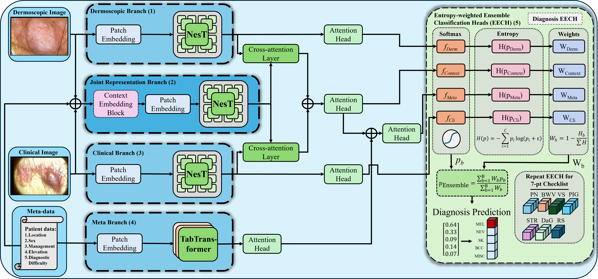

# DermFormer: Nested Multi-modal Vision Transformers for Robust Skin Cancer Detection

[](https://doi.org/10.1007/s10044-025-01572-0)
[](https://doi.org/10.1007/s10044-025-01572-0)
[](https://rdcu.be/eQT3s)
[](https://www.python.org/downloads/)
[](https://pytorch.org/)
[](LICENSE)

A transformer-based multi-modal architecture for skin cancer detection that maintains high diagnostic accuracy while demonstrating robustness to real-world data variations. DermFormer achieves state-of-the-art performance (diagnosis accuracy: 0.779, F-score: 0.684) on the Derm7pt dataset.

**Published in:** *Pattern Analysis and Applications*, Volume 28, Article 194 (2025)

## Overview

DermFormer addresses critical limitations in automated skin cancer detection by combining clinical images, dermoscopic images, and patient metadata through a hybrid fusion mechanism. The architecture achieves robust diagnosis through entropy-weighted ensemble classification heads that dynamically adjust modality contributions based on prediction confidence.

Key architectural components:
- **NeST (Nested Hierarchical Transformer)** backbones for clinical and dermoscopic image encoding
- **TabTransformer** for processing categorical patient metadata
- **Cross-attention fusion** enabling inter-modality interaction while preserving uni-modal feature integrity
- **Entropy-weighted ensemble** for dynamic modality weighting based on prediction confidence

The system performs multi-task learning across 8 dermatological classification tasks: primary diagnosis classification plus seven-point checklist prediction (pigment network, blue-whitish veil, vascular structures, pigmentation, streaks, dots/globules, regression structures).

## Performance

### Primary Metrics (Derm7pt Test Set)

| Metric | Value |
|--------|-------|
| **Diagnosis Accuracy** | 0.779 |
| **Diagnosis F-score** | 0.684 |
| **Validation Accuracy** | 0.741 |
| **Training Time** | ~42 minutes (147 epochs, early stopping) |
| **Model Size** | 211 MB |
| **Parameters** | 52M trainable |

**Dataset Split**: Derm7pt (413 train / 203 validation / 395 test cases)

### Robustness Evaluation

The model was evaluated under systematic corruption and noise injection to assess performance degradation under realistic clinical conditions.

**Corruption Testing** (18 distortion types across 5 severity levels):
- Noise variants: Gaussian, shot, impulse, speckle
- Blur variants: Gaussian, glass, defocus, motion, zoom
- Weather effects: Snow, spatter
- Digital artifacts: JPEG compression, pixelation, elastic transform
- Appearance changes: Contrast, brightness, saturation

Corruptions were applied to:
- Clinical images only
- Dermoscopic images only
- Both modalities simultaneously

**Noise Robustness Testing**:
- Gaussian noise injection at 21 levels (0.0 to 1.0 standard deviation)
- Tested on individual modalities and combined
- Performance degradation curves measured across noise spectrum

**Key Finding**: DermFormer maintains superior accuracy compared to baseline models (TFormer, NEST-DER, NEST-CLI, NEST-MMC) across all perturbation scenarios. The entropy-weighted ensemble mechanism enables graceful degradation by dynamically reweighting branch contributions when individual modalities become corrupted, rather than treating all inputs uniformly regardless of quality.

## Architecture

The architecture employs a hybrid fusion strategy that combines early fusion for metadata integration with late-stage cross-attention for image modalities.



**Processing Pipeline**:

1. **Uni-modal Feature Extraction**:
   - Clinical and dermoscopic images processed through separate NeST encoders
   - Categorical metadata (sex, age, location, elevation, lesion type) processed through TabTransformer
   - Preserves modality-specific feature representations

2. **Joint Representation Learning**:
   - Metadata spatially projected and fused with concatenated image data
   - Joint representation processed through hierarchical NeST network
   - Captures inter-modality relationships while maintaining computational efficiency

3. **Cross-Modal Fusion**:
   - Uni-modal image features undergo multi-head cross-attention with joint representation
   - Image features serve as queries; joint representation provides keys and values
   - Enables context-aware modality integration without compromising individual feature integrity

4. **Entropy-Weighted Ensemble**:
   - Four classification branches: Clinical, Dermoscopic, Combined, Meta-Combined
   - Branch weights computed dynamically from prediction entropy (inverse relationship)
   - Higher confidence branches receive greater weight in ensemble prediction
   - Adapts to varying data quality without retraining

5. **Multi-Task Prediction**:
   - Eight parallel classification heads for diagnosis and seven-point checklist features
   - Shared representations across tasks improve feature learning
   - Clinically interpretable outputs align with diagnostic protocols

## Quick Start

### Installation

```bash
# Clone repository
git clone https://github.com/xraikeele/DermFormer.git
cd DermFormer

# Create conda environment
bash setup_environment.sh
conda activate dermformer
```

### Training

```bash
# Train from scratch
python main_classification.py \
    --data_path /path/to/Derm7pt \
    --batch_size 16 \
    --epochs 200 \
    --lr 1e-4 \
    --patience 50
```

### Robustness Testing

```bash
# Test corruption robustness (18 distortion types)
python main_corruptions_test.py \
    --dir_release /path/to/Derm7pt \
    --log_path ./results/robustness/corruptions/ \
    --dermformer_model_path ./experiments/best_model.pth

# Test comprehensive robustness (noise + corruptions)
python main_robustness_experiments.py \
    --dir_release /path/to/Derm7pt \
    --log_path ./results/robustness/experiments/ \
    --dermformer_model_path ./experiments/best_model.pth
```

### Inference

```python
from models.DermFormer import DermFormer
import torch

# Load model
model = DermFormer(num_classes=5, hidden_dim=256)
checkpoint = torch.load('experiments/best_model.pth')
model.load_state_dict(checkpoint)
model.eval()

# Run inference
outputs = model(meta_cat, meta_con, clinical_img, dermoscopic_img)
```

## Interactive Demo

A comprehensive Jupyter notebook is provided for interactive exploration of model predictions:

```bash
cd notebooks
jupyter notebook DermFormer_Interactive_Demo.ipynb
```

**Notebook Features**:
- Visual predictions with confidence scores for all classification heads
- Branch-level analysis showing individual contributions from clinical, dermoscopic, combined, and meta-combined branches
- Entropy weighting visualization demonstrating dynamic modality reweighting
- Multi-task prediction comparison across diagnosis and seven-point checklist features
- Real Derm7pt case studies with ground truth annotations

## Robustness Experiments

Comprehensive evaluation tools assess model performance under controlled perturbations simulating real-world clinical conditions.

### Corruption Testing

Evaluates resilience to 18 corruption types based on established benchmarks (Hendrycks & Dietterich, 2019):

**Noise Corruptions**: Gaussian, shot, impulse, speckle
**Blur Corruptions**: Gaussian, glass, defocus, motion, zoom  
**Weather Effects**: Snow, spatter
**Digital Artifacts**: JPEG compression, pixelation, elastic transform
**Appearance Changes**: Contrast, brightness, saturation

Each corruption type is applied at 5 severity levels to construct degradation curves. Testing configurations include:
- Single modality corruption (clinical only, dermoscopic only)
- Multi-modality corruption (both simultaneously)
- Baseline comparison with standard test set

### Noise Sensitivity Analysis

Controlled Gaussian noise injection across intensity spectrum:
- 21 noise levels from 0.0 to 1.0 standard deviation
- Applied independently to clinical images, dermoscopic images, or both
- Measures performance degradation as function of noise intensity

### Comparative Analysis

All experiments compare DermFormer against baseline architectures:
- **TFormer**: Swin transformer with multi-head cross-attention (Zhang et al., 2023)
- **NEST-DER**: Dermoscopic-only NeST encoder
- **NEST-CLI**: Clinical-only NeST encoder  
- **NEST-MMC**: Simple concatenation-based multi-modal baseline

Results demonstrate that entropy-weighted ensemble fusion provides superior robustness compared to fixed-weight fusion strategies. When one modality becomes corrupted, the ensemble automatically reduces its contribution rather than degrading the entire prediction. This adaptive behavior is critical for clinical deployment where data quality cannot be guaranteed.

## Repository Structure

```
DermFormer/
├── models/
│   ├── DermFormer.py           # Main model architecture
│   ├── NesT/                   # NeST encoder variants
│   │   ├── nest_cli.py         # Clinical image encoder
│   │   ├── nest_der.py         # Dermoscopic image encoder
│   │   └── nest_multimodalconcat.py  # Concatenation baseline
│   └── tabtransformer/         # TabTransformer implementation
├── derm7pt/
│   ├── dataset.py              # Derm7pt data loader
│   ├── dataloader_corruptions.py  # Corruption dataset loader
│   └── dataloader_noise.py     # Noise dataset loader
├── experiments/
│   └── training_*/             # Training runs with checkpoints
├── notebooks/
│   ├── DermFormer_Interactive_Demo.ipynb
│   ├── sample_data/            # Demo cases with images
│   └── extract_demo_from_csv.py
├── main_classification.py      # Training script
├── main_corruptions_test.py    # Corruption robustness evaluation
├── main_robustness_experiments.py  # Comprehensive robustness testing
├── config.py                   # Configuration
└── setup_environment.sh        # Environment setup
```

## Requirements

- Python 3.7
- PyTorch 1.12.1 (CUDA 11.5)
- timm 0.6.13
- transformers 4.29.2
- albumentations 1.3.1
- See `requirements.txt` for full dependencies

## Dataset

**Derm7pt** (Kawahara et al., 2018): Benchmark dataset for multi-task skin lesion classification

**Diagnostic Classes** (5):
- Basal Cell Carcinoma
- Nevus
- Melanoma
- Miscellaneous
- Seborrheic Keratosis

**Input Modalities**:
- Clinical images (wide-field view, lesion context)
- Dermoscopic images (magnified structural details)
- Patient metadata (sex, age group, lesion location, elevation, diagnostic difficulty)

**Clinical Features** (7-point checklist):
- Major criteria: Atypical pigment network, blue-whitish veil, atypical vascular pattern
- Minor criteria: Irregular streaks, irregular pigmentation, irregular dots/globules, regression structures

**Dataset Statistics**:
- 1,011 total cases with complete annotations
- Train/Validation/Test split: 413/203/395
- All cases include paired clinical-dermoscopic images and metadata

**Download**: http://derm.cs.sfu.ca/

The seven-point checklist provides clinical interpretability by aligning model outputs with established diagnostic protocols used by dermatologists in practice.

## Citation

If you use this work, please cite:

```bibtex
@article{cockayne_dermformer_2025,
  title = {{DermFormer}: nested multi-modal vision transformers for robust skin cancer detection},
  volume = {28},
  issn = {1433-755X},
  url = {https://doi.org/10.1007/s10044-025-01572-0},
  doi = {10.1007/s10044-025-01572-0},
  abstract = {Deep learning shows strong potential for automated skin cancer detection, but clinical adoption requires models that maintain high diagnostic accuracy while demonstrating robustness to real-world data variations. Multi-modal approaches integrating dermoscopic images, clinical images, and patient metadata achieve superior performance compared to single-modality methods. However, existing fusion strategies inadequately address the performance-robustness trade-off, often improving accuracy on lab-quality data while compromising reliability under corrupted or noisy inputs typical of real-world clinical settings. We propose DermFormer, a transformer-based multi-modal architecture addressing this limitation through entropy-weighted ensemble classification heads and a hybrid fusion mechanism that preserves uni-modal representations while capturing inter-modality relationships. Our method combines dermoscopic and clinical images with tabular metadata using hierarchical transformers and cross-attention for modality integration. The entropy-weighted ensemble dynamically adjusts modality contributions based on prediction confidence, enabling dynamic feature selection when individual modalities are corrupted. We evaluate DermFormer on the Derm7pt dataset for multi-class diagnosis and seven-point checklist classification under clean and corrupted conditions. DermFormer achieves state-of-the-art performance (diagnosis accuracy: 0.779, F-score: 0.684) while maintaining superior robustness to common corruptions including Gaussian noise, motion blur, and JPEG compression. By maintaining performance under realistic clinical conditions, this work addresses a critical adoption barrier for automated diagnostic systems, enabling reliable AI-assisted dermatology across diverse healthcare settings and supporting earlier melanoma detection at scale. Code available at: https://github.com/xraikeele/DermFormer},
  number = {4},
  journal = {Pattern Analysis and Applications},
  author = {Cockayne, Matthew J. and Ortolani, Marco and Al-Bander, Baidaa},
  month = nov,
  year = {2025},
  pages = {194},
}
```

**Paper Links:**
- [Publisher (Open Access)](https://doi.org/10.1007/s10044-025-01572-0)
- [Free Read-Only Access](https://rdcu.be/eQT3s)

## License

This project is licensed under the MIT License - see LICENSE file for details.

## Contributing

Contributions are welcome. Please submit a Pull Request for any proposed changes.

## Contact

**Matthew Cockayne**
- GitHub: [@xraikeele](https://github.com/xraikeele)
- Email: [m.j.cockayne@keele.ac.uk]

## Acknowledgments

- Derm7pt dataset authors (Kawahara et al., 2018)
- NeST architecture (Zhang et al., 2021)
- TabTransformer (Huang et al., 2020)
- PyTorch and timm libraries

---

**Part of PhD Research Portfolio** | 2025